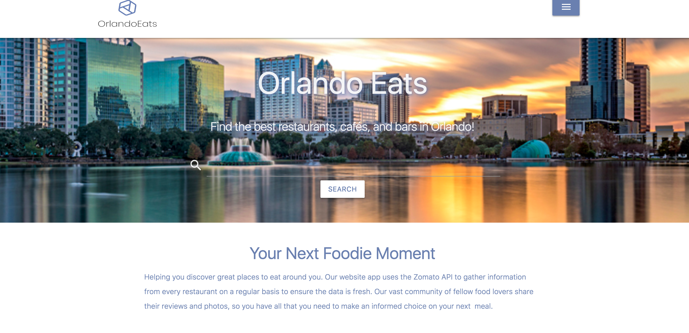
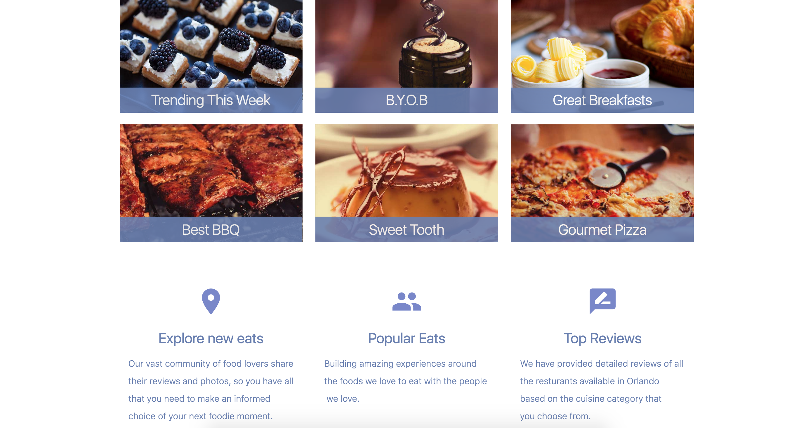
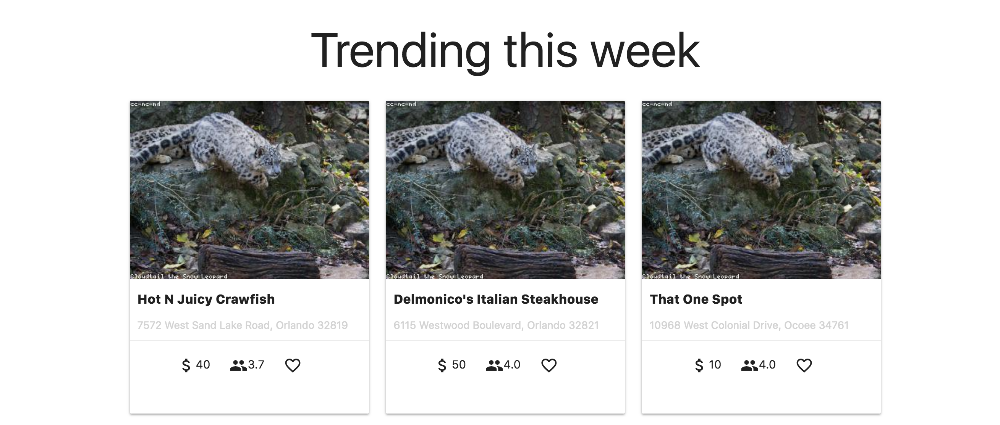
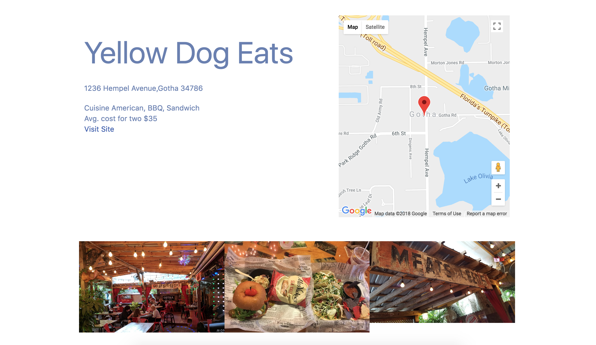

### Orlando Eats

* Web app for finding dining options in the Orlando area.
* Gives users dining catagories to select from.
* Displays results relevant to those catagories.
* Allows users to create an account to store favorites.

### Getting Started
The app can be found by clicking [here!](https://jasongoesplaces.github.io/OrlandoEats/)

### Built With
* [Firebase](https://firebase.google.com/) - The database and user authentication
* [Zomato](https://developers.zomato.com/api) - The api used for gather restaurant data
* [Materialize](http://materializecss.com/) - The css framework

### Authors
* Amani Alkowni - [aalkowni90](https://github.com/aalkowni90)
* Jason Schultz - [JasonGoesPlaces](https://github.com/jasongoesplaces)
* Kyle Shrote - [kyl3thegreat](https://github.com/kyl3thegreat)

### Screenshots

Home Page view #1

Home Page view #2

Home Page view #3

Search Results view

Restaurant Details view
